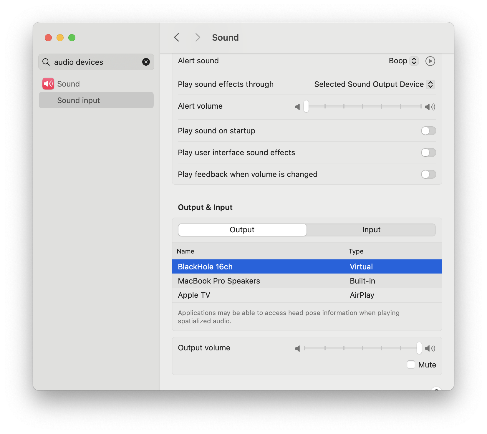

# tv-commercial-recognition
A POC system for recording, recognizing, and storing TV commercials with real-time detection capabilities.

---

### Record TV audio with ffmpeg

Purchase an [XIT stick](https://www.pixela.co.jp/products/xit/stk100/) and install the software.

Install and setup the [BlackHole](https://github.com/ExistentialAudio/BlackHole) audio driver to capture audio from XIT stick.

To record audio from XIT stick, select `BlackHole 16ch` as the audio output device, then use ffmpeg to record the audio.



```shell
# Find the device name
ffmpeg -f avfoundation -list_devices true -i ""
# [AVFoundation indev @ 0x14f0051b0] AVFoundation video devices:
# [AVFoundation indev @ 0x14f0051b0] [0] FaceTime HD Camera
# [AVFoundation indev @ 0x14f0051b0] [1] iPhone Camera
# [AVFoundation indev @ 0x14f0051b0] [2] Capture screen 0
# [AVFoundation indev @ 0x14f0051b0] AVFoundation audio devices:
# [AVFoundation indev @ 0x14f0051b0] [0] MacBook Pro Microphone
# [AVFoundation indev @ 0x14f0051b0] [1] Microsoft Teams Audio
# [AVFoundation indev @ 0x14f0051b0] [2] BlackHole 16ch
# [AVFoundation indev @ 0x14f0051b0] [3] iPhone Microphone

# Record audio from XIT stick into a file
ffmpeg -f avfoundation -i "none:2" -vn output.wav

# Record audio from XIT stick into a file, with a timestamp in the filename
ffmpeg -f avfoundation -i "none:2" -vn -strftime 1 %Y-%m-%dT%H%M%S%z.wav

# Record audio from a stream, detect silence and output original audio to a file at the same time.
ffmpeg -f avfoundation -i ":2" -af "silencedetect=noise=-100dB:d=0.8" -f null output.wav
```


---

To record into segments of 5 minutes, do this:
```
-f stream_segment outputs streams to a number of separate files of nearly fixed duration
-segment_time sets the length (in seconds) of each segment
-segment_atclicktime splits at regular clock time intervals (default is 0, no apparent difference in behavior)
-reset_timestamps sets the beginning timestamp of each segment to near-zero (I guess an audio file can start from non-zero time: 00:00:02~00:00:04)
ffmpeg -f avfoundation -i "none:0" -vn -f stream_segment -segment_time 10 -segment_atclocktime 1 -reset_timestamps 1 -strftime 1 %Y-%m-%dT%H%M%S%z.wav
```

### Find commercials in audio with pydub

You can split audio into segments by silence using pydub.
https://github.com/jiaaro/pydub/blob/master/API.markdown

**Note:** Loudness during commercial transition is something like -147 db and last for about 1 second
```
>>> audio[5750:6250].dBFS
-147.65079717877006
```

```py
from pydub import AudioSegment, silence

audio = AudioSegment.from_wav("commercials.wav")
# silence_thresh=-100 also seems to work
# min_silence_len=250, silence_thresh=-120 is a sweet spot
chunks = silence.split_on_silence(audio, min_silence_len=250, silence_thresh=-120, seek_step=1, keep_silence=False)

for i, chunk in enumerate(chunks):
    duration_seconds = len(chunk) / 1000
    # A google search says commercials are 15 seconds.
    # スポットＣＭ１本の基本の長さは１５秒である。
    # http://homepage1.canvas.ne.jp/minamihideyo/gensya-CMryoukin.htm
    if (13 < duration_seconds < 15) or (28 < duration_seconds < 30):
        print(f"chunk{i} is probably a commercial ({duration_seconds} seconds)")
        chunk.export(f"chunks/likely_commercial/chunk{i}.mp3", format="mp3")
    else:
        # Exporting large chunks takes a long time
        print(f"chunk{i} is too long/short to be a commercial ({duration_seconds} seconds)")
        chunk.export(f"chunks/likely_not_commercial/chunk{i}.mp3", format="mp3")
```

#### Note on param combinations

`silence_thresh` seems to work OK anywhere around 100~140

`min_silence_len=250` is recommended. Transitions in/out of commercial breaks are a little bit shorter than transitions between commercials. `250` picks up both pretty well, but also results in random short clips for "non" commercials. These can be filtered out pretty easily by checking the length of the sound clip (commercials should be around 15 or 30 seconds).

### Find commercials in audio with ffmpeg

You can also use ffmpeg to split audio into segments by silence.

* https://stackoverflow.com/questions/45526996/split-audio-files-using-silence-detection
* https://stackoverflow.com/questions/36074224/how-to-split-video-or-audio-by-silent-parts
* https://ffmpeg.org/ffmpeg-filters.html#silencedetect
* [This works well](https://gist.github.com/vi/2fe3eb63383fcfdad7483ac7c97e9deb)

```
ffmpeg -v warning -i "var/sample_commercials_only.wav" -af silencedetect="noise=-100dB:d=0.8",ametadata=mode=print:file=- -vn -sn -f s16le -y /dev/null

frame:206  pts:281190  pts_time:6.37619
lavfi.silence_start=5.58095
frame:209  pts:285285  pts_time:6.46905
lavfi.silence_end=6.4873
lavfi.silence_duration=0.906349
frame:1172 pts:1599780 pts_time:36.2762
lavfi.silence_start=35.5036
frame:1178 pts:1607970 pts_time:36.4619
lavfi.silence_end=36.4849
lavfi.silence_duration=0.981338
frame:1657 pts:2261805 pts_time:51.2881
lavfi.silence_start=50.5076
frame:1662 pts:2268630 pts_time:51.4429
lavfi.silence_end=51.464
lavfi.silence_duration=0.956463
frame:2140 pts:2921100 pts_time:66.2381
lavfi.silence_start=65.4424
frame:2147 pts:2930655 pts_time:66.4548
lavfi.silence_end=66.4555
lavfi.silence_duration=1.01304
...
```


### Processes

* A process to record audio from TV and save commercials to files.
* A process to fingerprint the commercial audio and store the fingerprints in a database.
* A process to listen to the audio stream, match the audio against the fingerprints in the database and take action when a commercial is detected.
